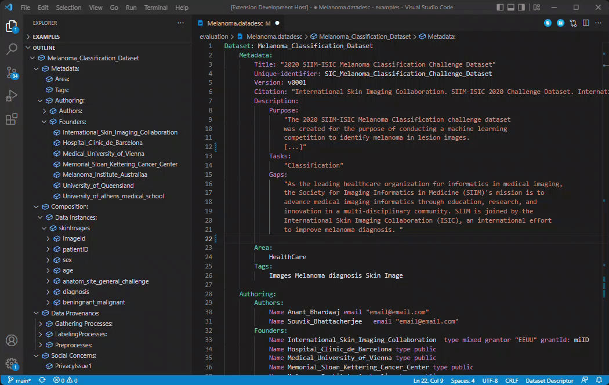

# Dataset-Descriptor
A Visual Studio Code language plugin to describe machine-learning datasets. This plugin helps you define your data's provenance, composition, and social concerns in a standard format. 

## Technical report: Examples using the DSL 

As an example of using our DSL over machine-learning datasets, we present a report **[here](https://github.com/ReviewInstrumental/DSL-dataset-description/blob/master/examples/evaluation/DSL-Dataset-definition-examples-report.pdf)** were we describe three benchmark datasets. The description files of the example datasets can be found in the **examples/evaluation** folder.

## Using the plugin

This work is still in a double-blind peer-review process. Therefore, the plugin is not published in the Visual Studio Code Market. Instead, a packaged release of the plugin, ready to be installed, can be found in the project's root folder. 

The file is **Dataset-Descriptor-0.0.1.vsix**

To install the package, open your terminal (or the terminal inside the VSCode) and write this:

```
git clone https://github.com/ReviewInstrumental/DSL-dataset-description.git datasets

cd datasets 

code --install-extension Dataset-Descriptor-0.0.1.vsix
```

*Troubleshooting: If you are not able to see the syntax highlighted in the examples files (p.e. *Melanoma.datadesc*) as the image below. Please, reload the VSCode editor and write the code --install command again*

*Recommendations: We recommend having the Visual Studio Code 1.56 version or above.*

Great! That's it.

Now go to the folder **/examples/evaluation** and open, for example, the *Melanoma.datadesc* file to see a working example of our preliminary evaluation.

Remember: by default, VSCode gives you auto-completion help by hitting CTRL + Space (or equivalent in MAC)

The full grammar in Extended Backus-Naur form (EBNF) can be seen in **src/language-server/dataset-descriptor.langium**




### Want to dive into language development?


You may need extra steps if you want to contribute or dive into the plugin or the language. As Langium (the base framework of the plugin) is not stable, there are a few actions we need to do manually.

1 - "npm install" to install dependencies.

2 - Then go to /node_modules folder and delete "langium" and "langium-cli" folder

3 - Copy the folder "langium" and "langium-cli" from folder /packages to /node_modules

4 - Get the folder /packages/langium-vscode and paste it inside your VSCode extension folder (tipically <user home>/.vscode/extensions)
  
5 - Install the Langium plugin through the UI of VSCode


This repo comes with an already built-in config to debug. Just go to Debug in VSCode, and launch the Extension config. Please check your port 6009 are free.
  
For more information about how the framework works and how the language can be extended, please refer to https://github.com/langium/langium or the VSCode extension API documentation https://code.visualstudio.com/api


